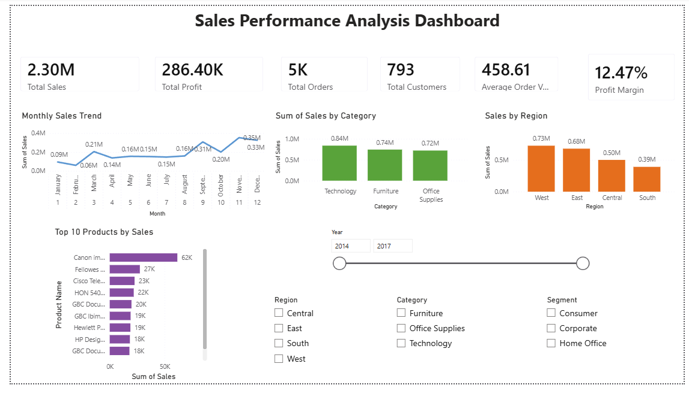

# 📊 Sales Performance Analysis Dashboard

A complete Business Intelligence project analyzing Superstore sales data using **Python, SQL, and Power BI**. This project focuses on identifying sales trends, profitability, customer behavior, and regional performance through an interactive dashboard.

---

## 🚀 Project Overview

This project transforms raw sales data into meaningful business insights through data cleaning, analysis, and visualization.

The dashboard enables users to:

- Monitor Total Sales and Profit
- Track Monthly Sales Trends
- Analyze Sales by Category
- Compare Regional Performance
- Identify Top Selling Products
- Filter data by Year, Region, Category, and Segment

---

## 🛠️ Tools & Technologies

- 🐍 Python (Pandas, Matplotlib)
- 📊 Power BI
- 🗄️ SQL
- 📑 Microsoft Excel
- 🌐 Git & GitHub

---

## 📂 Repository Structure

```text
Sales-Performance-Analysis/
│
├── 📁 Dataset/
│   ├── Sample_Superstore.csv
│   └── Cleaned_Superstore(Business Analysis).csv
│
├── 📁 Images/
│   ├── dashboard.png
│
├── 📁 PowerBI/
│   └── Sales_Performance_Analysis.pbix
│
├── 📁 Python/
│   └── Sales_Performance_Analysis.ipynb
│
├── 📁 SQL/
│   └── sales_analysis.sql
│
├── 📁 Presentation/
│   └── Sales_Performance_Analysis_Presentation.pptx
│
├── 📁 Report/
│   └── Sales_Performance_Analysis_Project_Report.pdf
│
├── 📄 README.md
└── 📄 .gitignore
```
---

# 📈 Dashboard Preview



---

## 📌 Dashboard KPIs

| KPI | Value |
|------|--------|
| Total Sales | 2.30M |
| Total Profit | 286.40K |
| Total Orders | 5009 |
| Total Customers | 793 |
| Average Order Value | 458.61 |
| Profit Margin | 12.47% |

---

## 📊 Dashboard Features

- KPI Cards
- Monthly Sales Trend
- Sales by Category
- Sales by Region
- Top 10 Products by Sales
- Interactive Slicers
  - Year
  - Region
  - Category
  - Segment

---

## 🔍 Key Business Insights

- Technology generated the highest sales among all categories.
- The West region recorded the highest sales.
- The South region contributed the lowest sales.
- A small number of products generated a significant share of total revenue.
- Monthly sales show seasonal fluctuations that can help with demand forecasting.

---

## ▶️ How to Use

1. Clone the repository

```
git clone https://github.com/mohitbhilala005/Sales-Performance-Analysis.git
```

2. Open the Power BI file

```
PowerBI/Sales_Performance_Analysis.pbix
```

3. Explore the interactive dashboard.

---

## 📷 Dashboard Screenshot

The dashboard provides interactive visualizations with slicers for detailed analysis.

---

## 👨‍💻 Author

**Mohit Bhilala**

GitHub: https://github.com/mohitbhilala005

LinkedIn: *(Add your LinkedIn profile link here)*

---

## ⭐ If you found this project useful

Please consider giving this repository a ⭐ on GitHub.
